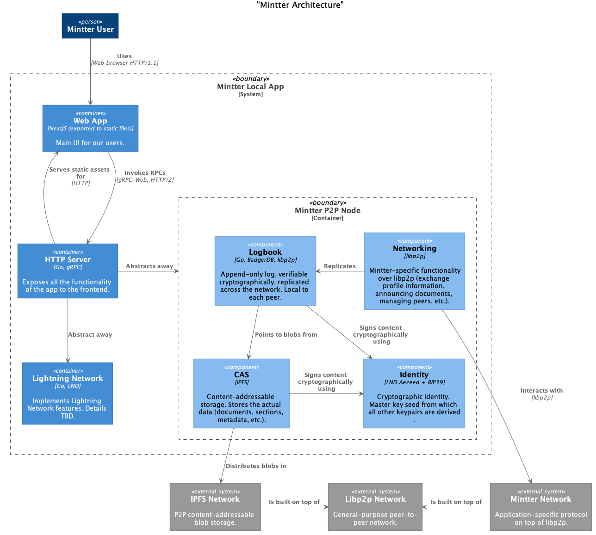

## Architecture

This document attempts to roughly describe the architecture of the system with
varying levels of details. It´s a living document so feel free to correct,
comment, add, remove and give feedback on anything.

Mintter Local App is a desktop application that each user installs on their
machine. We haven´t decided yet on how it´s going to be packaged. We´d like to
avoid using Electron for many different reasons (no tabs, memory usage, etc.)
and stick to the browser functionality as much as possible (similar to how
uTorrent Web works). So all the functionality of the app is exposed by an API
server and a Web App that´s using it. The app is supposed to be long-running
(we'll have to figure out to what extent).

## P2P

Several of the app's components (including Lightning Network) are working in a
peer-to-peer fashion. We are not striving to pursue "Decentralize or die" goal
and we'll probably have some Mintter Cloud super-peer eventually.

## Networking

We deal with several layers of networking. First of all, Lightning Network has
its own p2p network, very coupled to the use case of payments. On the other
hand, there's [libp2p](https://libp2p.io) which is a general-purpose networking
toolkit for p2p applications. On top of libp2p there's IPFS network (which is
specific to storing and distributing data in a content-addressable fashion). On
top of libp2p as well, there's Mintter Network, which is specific to the use
case of our app.

## Identity

Each of the mentioned networks requires its own identity, which is normally a
cryptographic key pair (private and public).

For the sake of usability we generate a single cryptographic seed (master key)
from which we derive all the necessary key pair using key derivation functions
specific to each network. The master key is encoded as 24 human-readable words
which users must store securely. See
[BIP-39](https://github.com/bitcoin/bips/blob/master/bip-0039.mediawiki) and
[Aezeed](https://github.com/lightningnetwork/lnd/blob/master/aezeed/README.md)
for more info.

## Logbook

The concept of the Logbook is highly inspired by
[Scuttlebutt](https://scuttlebutt.nz), [Dat](https://dat.foundation) and its
[Hypercore](https://github.com/mafintosh/hypercore), and
[Qri Logbook](https://qri.io/docs/reference/logbook).

Logbook allows peers to keep track of changes and exchange information about
documents and other metadata (tiny!) without transferring the actual data
(potentially big!). It comprises the view of the Mintter world for any given
peer.
