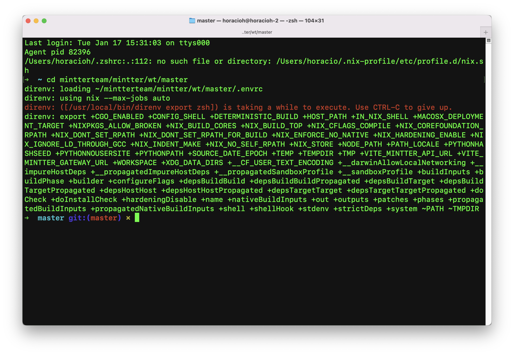

# Frontend Development Setup

The Mintter Frontend architecture is based on a [yarn](https://yarnpkg.com) workspace. Currently we have this packages:

1. App Package: for the desktop app code lives
2. Gateway: for the gateway code
3. Shared: for the shared API-related code
4. UI (soon): for all the design system/common UI building blocks for all the Mintter applications

After you [setup the project](./dev-setup) on your local machine, you should have `yarn` available, so no need to install it globally.

## Prerequisites

Please make sure that after you enter the repo root path, you see something similar to this showing the necessary Environment variables set:



After this is correct, you should run `yarn install` (or `yarn`) to install all the frontend packages.

## Run the Desktop app locally

because we are using [Nix](./nix), we are able to create custom orchestrated commands in order to setup everything properly for any situation. To run the desktop app locally, you just need to run:

```bash
./dev run-desktop
```

This command should trigger a set of processes that eventually should launch the app in dev mode


> you can also run `./dev` to print the stript's readme and see all the possible commands/options. You can checkout all the commands [here](https://github.com/mintterteam/mintter/blob/master/dev)

Keep in mind that `./dev run-desktop` runs both the desktop app **and the go backend**. This is setup this way for convenience and ease of use. You are able to run _just_ the desktop frontend code by running:

```bash
./dev run-frontend
```

> You can also run _just_ the backend with `./dev run-backend`

## Run the Gateway app locally

The same way we can run the desktop app with a `./dev` command, you have access to gateway-specific commands:

```bash
./dev run-gw-frontend 		# run the gateway frontend _only_ (dev mode)
./dev run-gw-bacend			# run the gateway backend _only_ (dev mode)
```

## Shared package

The frontend shared package is wrapping all the API/Backend related code that is shared between both the desktop app and the web gateway. You don't have to manually run any command for this, but you can check the specific commands defined for this package in the [root `package.json`](../package.json).

## Per-package scripts overview

For every frontend package, there's a set of required scripts in order to keep consistency inside all the project:

1. `dev`: run the current package in dev mode.
2. `build`: build the current package.
3. `test`: run all the possible tests inside the current package.
4. `lint`: run all the possible linters inside the current package.
5. `format`: format the code for the current package.
6. `validate`: lint + test the current package.

> if you are creating a new frontend package, please make sure you create this scripts properly and connect them with the appropiate `./dev` script.


