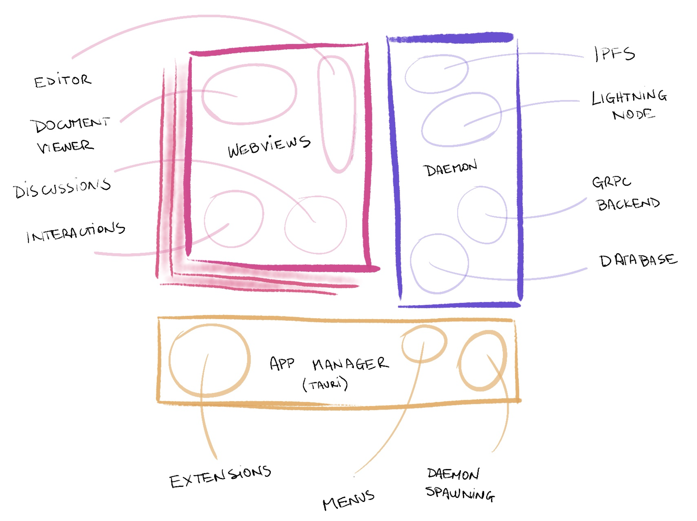
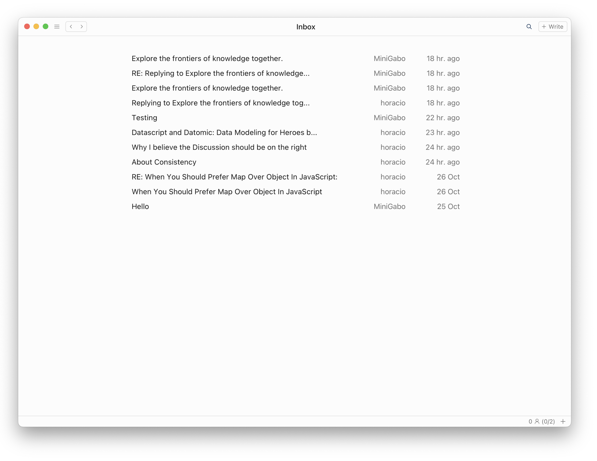
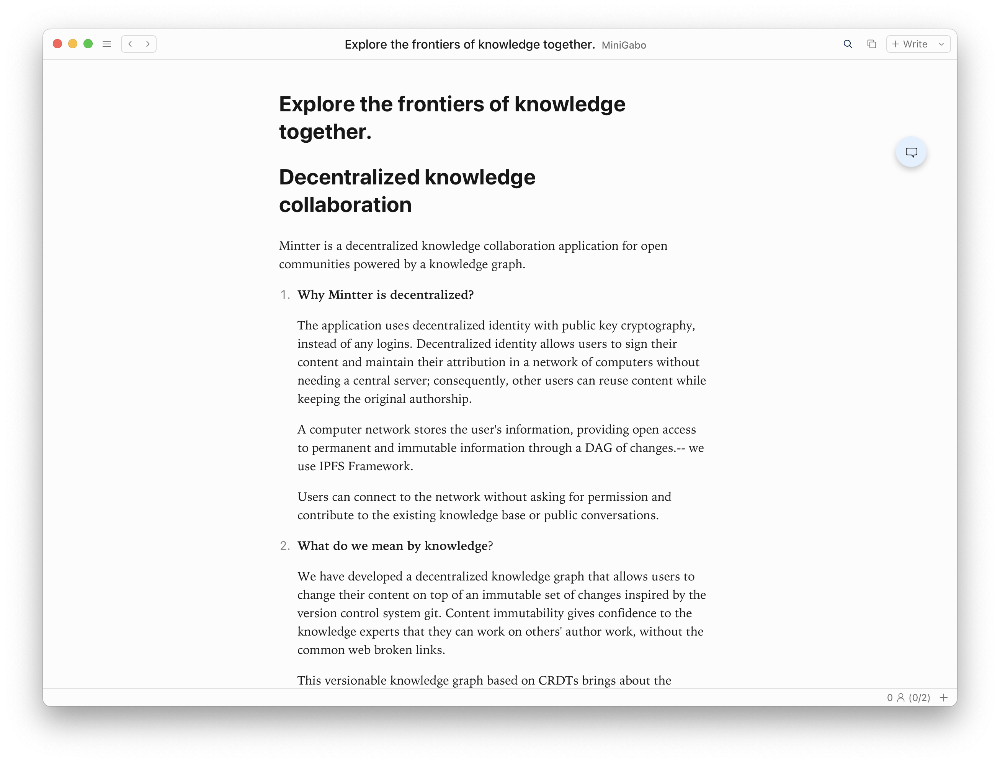

# Mintter technical guide

## Introduction

Mintter is a decentralized knowledge collaboration application. It’s built on [IPFS](https://ipfs.tech), it’s peer-to-peer (P2P), and strives to be [local-first](https://www.inkandswitch.com/local-first/). This document assumes that readers are at least somewhat familiar with the mentioned concepts, and with what Mintter is about.

## [HyperDocs](./hyperdocs)

An open protocol for collaboration and sharing permanent knowlege

- [Terra](./hyperdocs-terra) - IPFS network + semantic content types for documents and discussion
- [Aqua](./hyperdocs-aqua) - gRPC over p2p protocol for sharing links to Terra content
- [Aer](./hyperdocs-aer) - Web protocol for introducing users into HyperDocs

The HyperDocs protocol is initially designed by the Mintter team but is ultimately defined by community consensus.

## Mintter.App

The desktop app that the Mintter team develops. Provides the following features

- Cross Platform - Runs on Windows, macOS, Linux
- Peer-to-Peer - Does not rely on any centralized servers
- Offline First - Works great even if your computer is frequently offline

## Mintter.Web

The web gateway that the Mintter team develops

## Mintter Documents

Mintter Documents are containers of content blocks, arranged in hierarchical tree structures.

Anyone can create content blocks, edit them, move around blocks or whole subtrees of blocks.

Published documents can be linked from other documents, and you can bring in portion of some document into your own document, always keeping the trace to the original. This is called a Transclusion.

Many of the challenges we faced trying to develop such a system on top a decentralized network like IPFS didn’t have easy plug-and-play solutions at the time. This includes:

- Decentralized Identity
- Version Control
- Multi-Device
- Rich Hypertext Capabilities

## High-Level Architecture

### Local-First

As mentioned in the introduction, we want our app to follow the principles of the local-first software. The original paper (linked above) is a highly recommended read.

We believe that P2P technology could enable superior local-first experiences, and we bet on IPFS and Libp2p to become major parts of this journey.

### Desktop App

Mintter is a desktop app. Here’re some images and videos (click to expand).

Here are some screenshots of the current application

We created this [Mintter Showcase Video Playlist](https://www.youtube.com/playlist?list=PL_Q4x-stM4VLRlMN3xxtN_uj5KesC6DNU) to show some of the core features you can find in the current Desktop app.