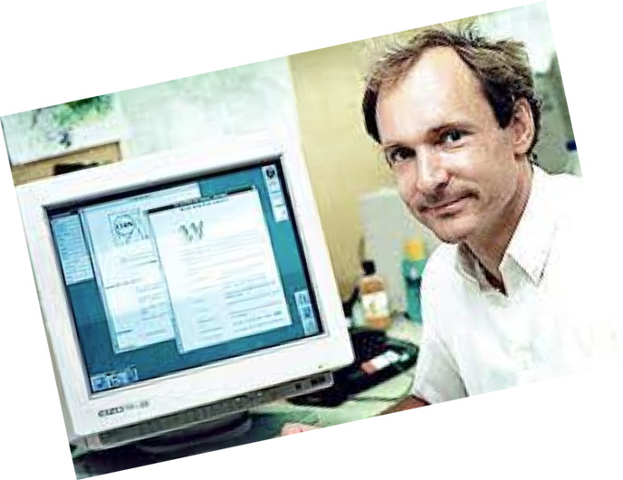
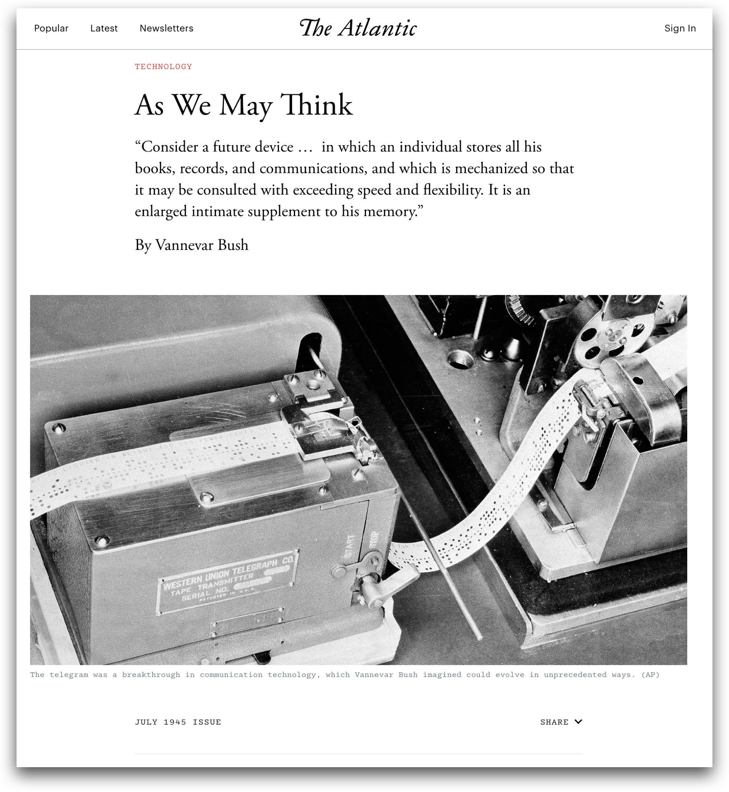
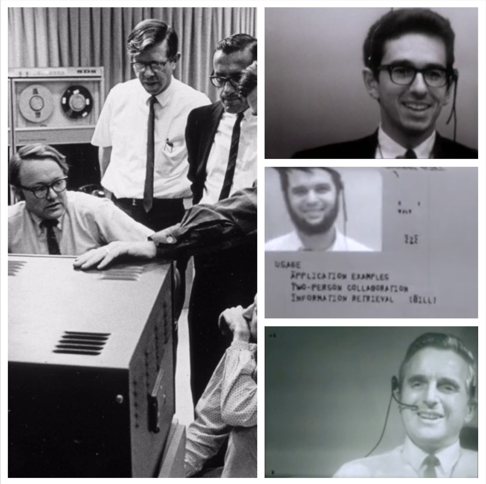
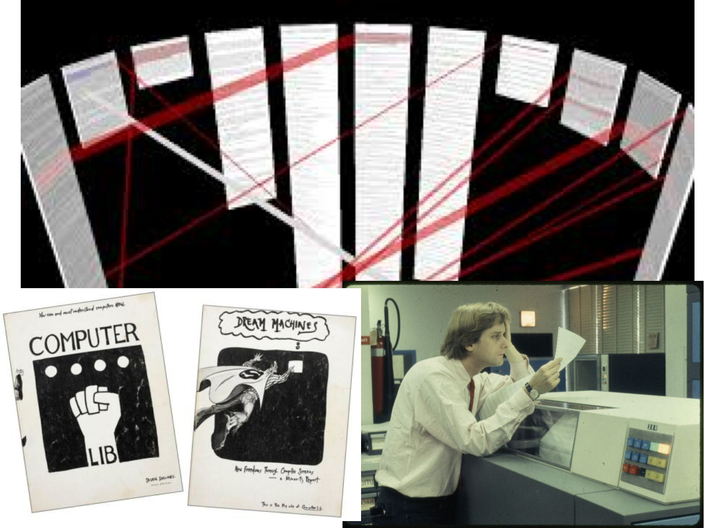
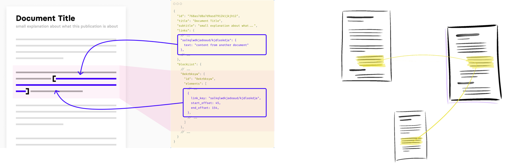
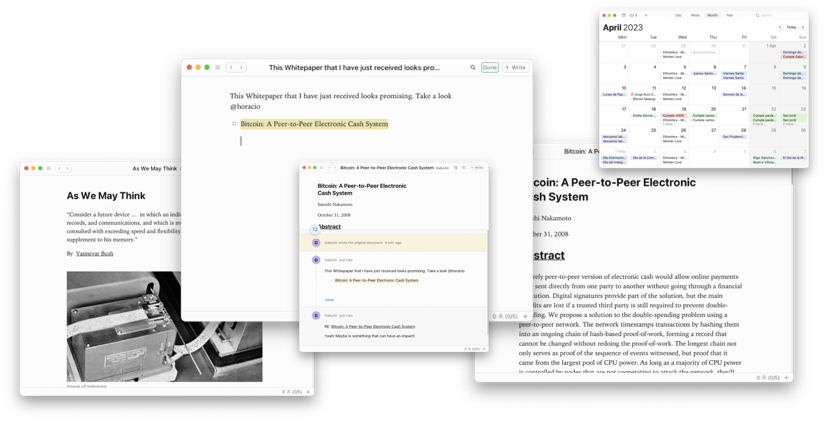
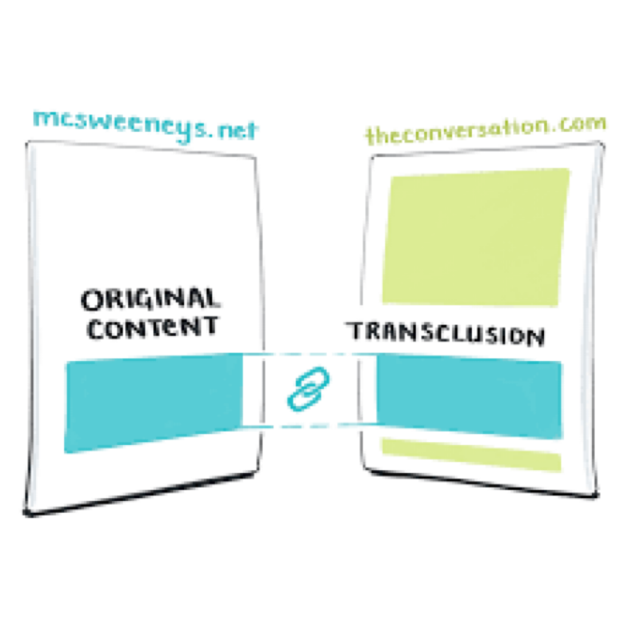

# What is Mintter

Mintter is a decentralized application for collaboration and publishing powered by a syncable knowledge graph. The purpose of the Company is to augment human intelligence decentralising web collaboration.

### Introduction to the problem

In 1989, Tim Berners-Lee created the web in CERN, the European scientific center in Switzerland and commercialised by Marc Andreessen with Netscape.

Decentralized publishing was the key success factor of the web in the 90s.

**The Internet has more than 5 billion users**

But it's limited hypertext capabilities makes decentralized collaboration impossible. Something as simple as adding a comment to an image needs a central server.

**Cristiano and Maradona do not own this picture!**

**A central authority owns your pictures and social interactions**

And not only your family pics, but your ideas too, and the connection between them. Google is the only entity in the world that knows who is referring to whom.

The Central Authority incentive is the advert not the collaboration, creating the Attention Economy. The social dialogue needed to bring learning and progress to society is fragmented, noisy and hostile.

**Experts are leaving Online Communities everywhere:**

### To better understand the problem, we embarked on a fascinating journey back to 1945, where we traced the origins of hypertext.

### In 1945, Vannevar Bush wrote As We May Think, the conception of Hypertext

The Memex stores the **associations of our minds** in a machine, that you can **share.** Vannevar called them **Trails**.

### **In the 60s, Doug Engelbart creates the first Hypertext system to ‘Augment Human Intellect’**

Fine-grained linking—everything is addressable , of hierarchical documents, in an Open Hypertext System will boost our collective intellect.

### **and Ted Nelson coins the word ‘Hypertext’ and creates Xanadu**

Hypertext properties essential for human collaboration: distributed storage system, bidirectional, transclusions, micropayments, visible connections, parallel pages.

### **And we found the web missing features to enable decentralized collaboration**

- Authorship
- Distributed file system providing permanent content
- Better links:
    - Everything should be linkable at the character level
    - Bidirectional linking
    - Unbreakable links
- Block-based hierarchical document
- Versionable and editable pages
- Annotations and discussions
- A micropayment system: The only viable business model for the web is the attention economy. The incentive is clicking an ad instead of knowledge creation and progress.

We need a new generation of digital tools, that brings collaboration to the decentralized web. The missing hypertext properties will upgrade the web. Mintter will be part of the change.

**Ted & Doug scream horrified missing them**

## Mintter

### Create a p2p collaboration space for your knowledge community.

Scientist groups, citizen movements, or tech communities, can discuss and build knowledge bases without central authorities or gatekeepers. Build your knowledge community with direct connections to your peers and enjoy permission-less participation with no risk of de-platforming.

**The web of sovereign peers, bring back experts to Online communities**

**IPFS, p2p filesystem**

Mintter App includes an IPFS, a distributed filesystem, where you share directly to your peers with no gatekeepers.

### Share your ideas and content retaining your authorship / ownership

Publish anything—from research papers to video game guides—and watch as other users read, disseminate and discuss your material online, building upon your original. Every piece of content, text or media, is cryptographically signed. Own your content while sharing it with your peers.

**Identity and Wallet**

Bip39 digital identity, Content digital signatures, Multi-device, Contacts, Verify contacts, Manage contacts, Micropayments, Lightning Node, Lightning Transactions, Lightning Balance

### Write and change your articles

Mintter Documents are containers of content blocks arranged in hierarchical tree structures. Collaborate on documents using a decentralized network of computers where updates are recorded as an immutable set of changes.

**Version Control System for Documents**

A CRDT (Conflict-free Replicated Data Type) is a data structure that can be used in distributed systems to ensure that data is automatically replicated across multiple nodes, without the need for a central authority.

### Create and transfer knowledge with a better collaboration UX

Address permanent content down to character level. Information immutability and fine-grained link will boost the knowledge generation of your open community. Let backlinks find different perspectives. To express your ideas you need to reuse other people’s ideas. Annotate and discuss anything. Social Commentaries and Annotations in the context. Knowledge Collaboration needs Commentary.

**Rich Hypertext Capabilites**

**Comment and Discuss anything in with your peers**

**Multiple windows**

The citation process with multiple windows is much more accessible, boosting the linking between texts.

### Control what you see and how you see it at an incredible speed

Browsing experience 10x faster than the web. Local first application were users control their interfaces and the information they see: fast, multi-device, offline, collaboration, longevity, user-control.

**Local First application**

### **Publish to the Web with versioning, authorship, and royalties**

Access to worldwide audience and collaboration by publishing to the web all your documents and updates become your own publisher with your own the authority that gives your own domain.
Publish to the web with one click to [mintter.com](http://mintter.com/) or to your own website. You can also share your content in social media, through mail or you favourite p2p networks.

**Royalties**

Micropayments are splitting among the different authors of a document.

### A new distribution channel for your ideas with a fair copyright system for the web

Reuse fragments of content keeping the authorship of the original author. Your peers will discover the new content thanks to the reusability, making transclusions a new distribution change without gatekeepers.
Easily compose trails of content from your communities and peers.

**Transclude content keeping attribution and royalties**

Ted Nelson created the concept of transfusions, allowing digital reusability with an easy copyright.

### **Build your own media publisher or Wikipedia-style knowledge base**

Create from your own personal blog or academic paper to your community’s knowledge base, wiki, media outlet, or repository of documents in the web.
Become your own publisher with versioning, authorship and accept micropayments in the web or mintter app creating your own repository of content.

**Graph Database**

A set of Mintter Documents build a syncable local graph database

